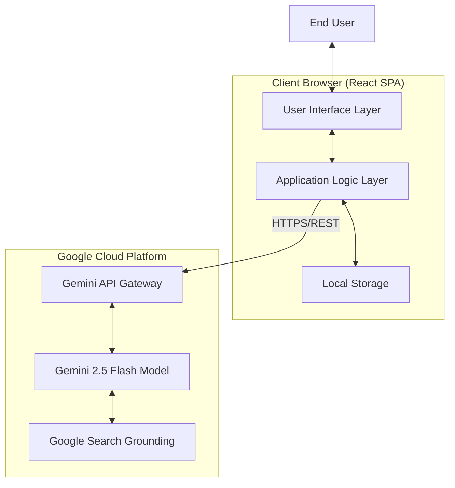

# Veritas AI: High-Level Design (HLD)

## 1. Introduction
Veritas AI is a client-side Single Page Application (SPA) designed to provide real-time fact-checking services. It leverages Large Language Models (LLMs) with web-search grounding to verify user claims against current information.

## 2. System Architecture
The system follows a Serverless / Client-Side architecture. There is no custom backend server; the frontend application communicates directly with the Google Gemini API.

### 2.1 High-Level Diagram

### 2.2 Key Components
1.  **Client Browser (Frontend):**
    *   **UI Layer:** React components handling user input, history display, and result visualization.
    *   **Logic Layer:** Manages application state, handles API communication via the `@google/genai` SDK, and parses responses.
    *   **Local Storage:** Persists user history locally within the browser for privacy and speed.

2.  **External Services:**
    *   **Gemini API:** The interface for interacting with Google's AI models.
    *   **Google Search Grounding:** A tool integrated into the model that performs live web searches to validate generated content.

## 3. Design Constraints & Requirements
*   **Latency:** The system must handle variable latency (2-5 seconds) inherent in LLM + Search operations by providing clear feedback (spinners).
*   **Privacy:** No user data is stored on a custom server; all history is local.
*   **Accessibility:** The UI must support screen readers and keyboard navigation.
*   **Responsiveness:** The layout must adapt to mobile and desktop viewports.

## 4. Technology Stack
*   **Frontend Framework:** React 19
*   **Language:** TypeScript
*   **Styling:** Tailwind CSS
*   **AI SDK:** `@google/genai` (Web/Client version)
*   **Build Tooling:** ES Modules / CDN (No heavy bundler required for this architecture)
