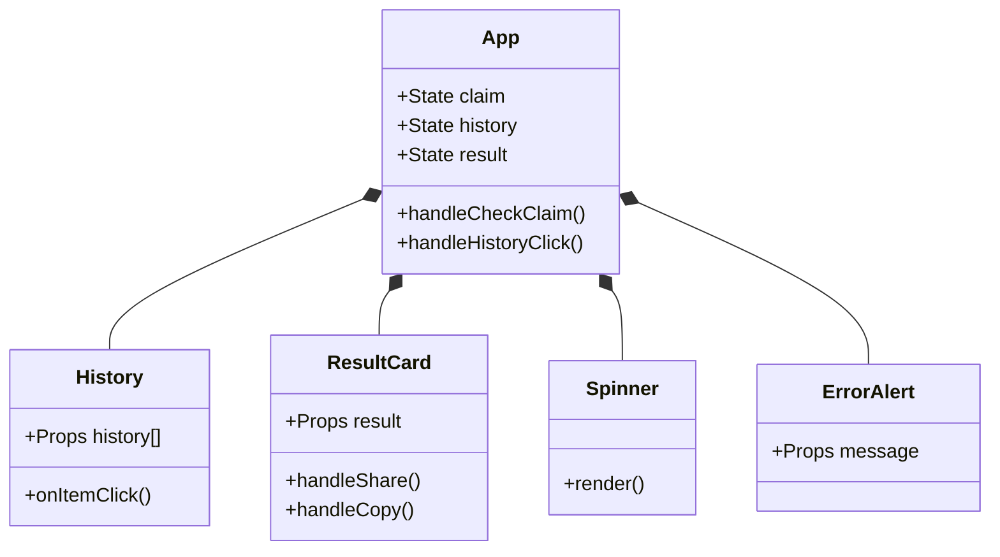

# Veritas AI: Low-Level Design (LLD)

## 1. Component Structure
The application is structured as a tree of React components.



## 2. Data Models (`types.ts`)

### 2.1 Core Interfaces
*   **`FactCheckResult`**: The primary data object moving through the system.
    ```typescript
    interface FactCheckResult {
      verdict: 'TRUE' | 'FALSE' | 'MIXED';
      explanation: string;
      sources: GroundingChunk[];
    }
    ```
*   **`GroundingChunk`**: Represents a source returned by Google Search.
    ```typescript
    interface GroundingChunk {
      web: {
        uri: string;
        title: string;
      }
    }
    ```

## 3. Service Layer (`geminiService.ts`)

### 3.1 Function: `factCheckWithGoogleSearch`
*   **Input:** `claim` (string)
*   **Output:** `Promise<FactCheckResult>`
*   **Logic:**
    1.  Initialize `GoogleGenAI` with `process.env.API_KEY`.
    2.  Construct prompt with strict formatting instructions: "Begin your response with... VERDICT: [STATUS]".
    3.  Call `ai.models.generateContent` with `tools: [{googleSearch: {}}]`.
    4.  **Response Parsing:**
        *   Split response text by newline.
        *   Find line starting with "VERDICT:".
        *   Extract status (TRUE/FALSE/MIXED).
        *   Join remaining lines as `explanation`.
        *   Extract `groundingMetadata.groundingChunks` for sources.
    5.  **Error Handling:** Catch API errors and throw a user-friendly message.

## 4. State Management

### 4.1 Application State (`App.tsx`)
*   **`history`**: Array of `HistoryItem` objects.
    *   *Persistence strategy:* `useEffect` hook monitors changes to `history` and syncs with `localStorage` key `'factCheckHistory'`.
*   **`isLoading`**: Boolean flag to toggle input disable state and Spinner visibility.
*   **`error`**: String or null, controls `ErrorAlert` visibility.

## 5. External Integration Details

### 5.1 Sharing Mechanism (`ResultCard.tsx`)
*   **Library:** `html2canvas`
*   **Logic:**
    1.  Select the DOM element for the card using `useRef`.
    2.  Render canvas with `scale: 2` (for Retina displays) and white background.
    3.  Convert canvas to Blob.
    4.  Use `navigator.share` (Mobile) or create a download link (Desktop).

### 5.2 API Configuration
*   **Model:** `gemini-2.5-flash`
*   **Safety Settings:** Default (Balanced).
*   **Tools:** `googleSearch` explicitly enabled.
