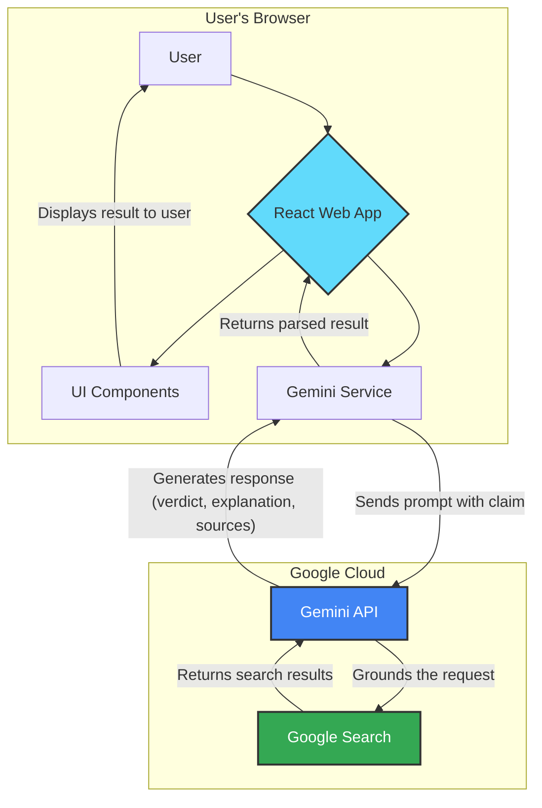

# Veritas AI: Application Architecture

This diagram illustrates the high-level architecture of the Veritas AI application. It follows a simple client-server model where the frontend application communicates directly with the Google Gemini API.

## Components

-   **React Web App**: The single-page application (SPA) that the user interacts with. It manages the UI state and orchestrates the data flow.
-   **UI Components**: Reusable React components for rendering the input form, result card, error alerts, and other UI elements.
-   **Gemini Service**: A dedicated module that encapsulates the logic for communicating with the Gemini API. It constructs the prompt, makes the API call, and parses the response.
-   **Gemini API**: The backend AI service from Google that processes the natural language prompt.
-   **Google Search**: Used as a grounding tool by the Gemini API to fetch real-time, verifiable information from the web to ensure the factual accuracy of the response.