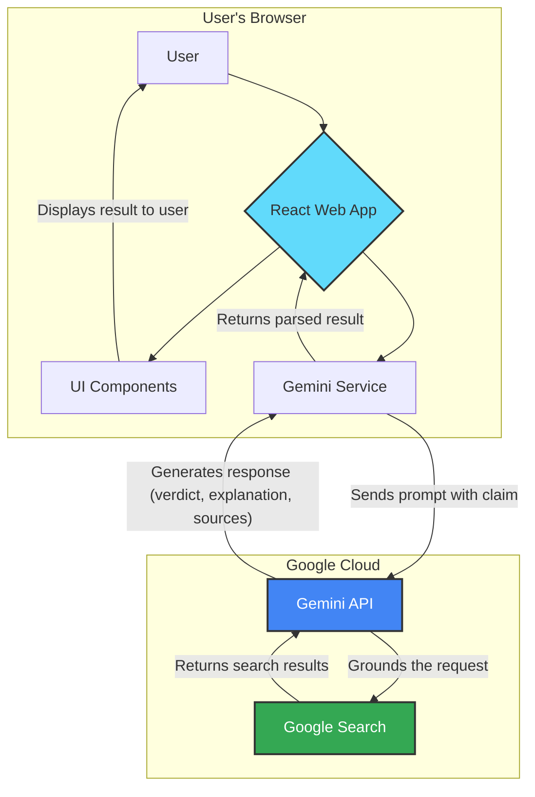
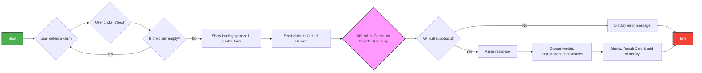
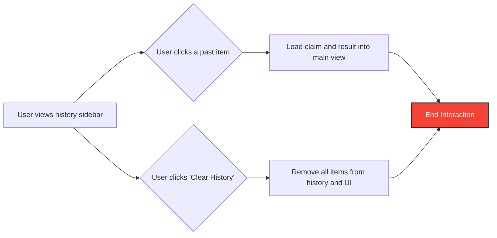
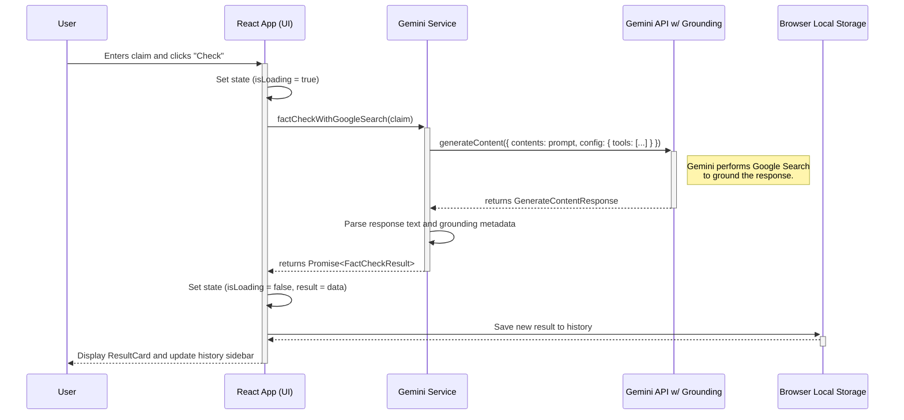
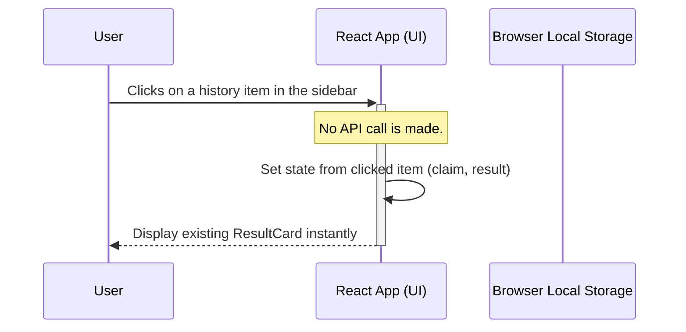

# Architecting Truth: Building a Real-Time Fact-Checker with Gemini & Search Grounding

*A technical deep-dive into building "Veritas AI" — a serverless, grounded AI application.*

In an era saturated with information, the latency between a false claim spreading and a fact-check publishing is often too long. As engineers, we have new tools to bridge this gap. This weekend, I built **Veritas AI**, a real-time fact-checking application that leverages Google's Gemini API with **Search Grounding** to verify claims instantly.

This article breaks down the **High-Level Design (HLD)**, **Low-Level Design (LLD)**, and the engineering challenges of "grounding" LLMs.

---

## 1. The Engineering Challenge

Standard LLMs are excellent creative engines but unreliable fact databases. They suffer from two main issues for this use case:
1.  **Hallucination**: They can confidently invent facts.
2.  **Knowledge Cutoffs**: They don't know what happened five minutes ago.

To build a reliable fact-checker, we need **Retrieval-Augmented Generation (RAG)**. Typically, RAG requires building a vector database, managing embeddings, and maintaining a retrieval pipeline.

However, Google's **Search Grounding** simplifies this by allowing the model to "use" Google Search as a tool during inference. It fetches live results and—crucially—attributes parts of its response to those specific URLs.

---

## 2. High-Level Architecture (HLD)

For this implementation, I chose a **Client-Side / Serverless** architecture. By using the `@google/genai` SDK directly in the browser, we reduce infrastructure complexity and latency.

*Note: In a production environment with paid quotas, you would move the API calls to a proxy server to secure your API keys. For this architectural demo, a direct client-implementation suffices.*

### System Diagram

The following diagram illustrates the component interaction within the React application and its integration with Google Cloud services.



### Key Design Decisions
1.  **Direct Integration**: Eliminating the middle-tier reduces the time-to-first-byte (TTFB), which is critical because the Search Grounding step adds intrinsic latency (approx. 2-3 seconds).
2.  **Local Persistence**: To respect user privacy and avoid database costs, fact-check history is persisted in the browser's `localStorage`.
3.  **Strict Typing**: TypeScript interfaces mirror the expected structure of the grounded response, ensuring the UI doesn't crash if the model returns unexpected metadata.

---

## 3. User Flow Strategy

To ensure a smooth user experience (UX) while handling asynchronous AI operations, the flow is split into two distinct interactions.

### Main Fact-Check Loop
The core loop handles the state transitions from "User Input" to "Verified Result".



### History Management
Since we are serverless, we use the browser's `localStorage` as a lightweight database.



---

## 4. Sequence of Operations (LLD)

The interaction is more complex than a standard chatbot. We aren't just sending text; we are configuring a "tool use" session.

1.  **The Trigger**: User submits a claim (e.g., *"The Eiffel Tower grows in summer"*).
2.  **The Config**: The app initializes the Gemini client with the `googleSearch` tool enabled.
3.  **The Thinking**: The model analyzes the prompt. It recognizes it needs external verification.
4.  **The Grounding**: It queries Google Search.
5.  **The Synthesis**: It combines the search results with its internal knowledge to form a verdict.
6.  **The Parsing**: The client app receives raw text and metadata, which must be parsed into a structured UI card.

### New Fact-Check Request

This diagram shows the process when a user submits a new claim to be fact-checked.



### Loading from History

This diagram shows the simple, client-side process when a user clicks on a previously checked item in the history sidebar.



---

## 5. Prompt Engineering for Deterministic UI

One of the hardest parts of integrating LLMs into UI is getting **structured data**. For Veritas AI, I needed a specific format to render the "True", "False", or "Mixed" badges correctly.

Instead of relying on JSON mode (which can sometimes be verbose or fickle with tool use), I used a **Prefix Enforcement** strategy.

**The Prompt:**
```typescript
const prompt = `Analyze the following statement for its factual accuracy. 
Begin your response with one of the following verdicts on a single line: 
"VERDICT: TRUE", "VERDICT: FALSE", or "VERDICT: MIXED". 
After the verdict, provide a concise but detailed explanation...`;
```

**The Parsing Logic:**
By strictly enforcing the first line, the frontend logic becomes robust:

```typescript
const fullText = response.text;
const lines = fullText.split('\n');
// We know line 0 (or the first non-empty line) MUST be the verdict
const verdictLine = lines.find(line => line.toUpperCase().startsWith('VERDICT:'));

if (verdictLine.includes('TRUE')) return Verdict.TRUE;
// ... handle others
```

This hybrid approach—structured prompt engineering combined with resilient client-side parsing—provides the reliability of an API with the flexibility of an LLM.

---

## 6. Handling Grounding Metadata

The real magic happens in the `groundingMetadata`. The API returns a list of "Chunks" (sources).

My `types.ts` defines this contract:

```typescript
export interface GroundingChunk {
  web: {
    uri: string;
    title: string;
  };
}
```

The app dynamically maps these chunks to the UI, creating a transparent "Sources" section. This effectively creates a bibliography for every generated answer, solving the "trust me bro" problem inherent in standard LLMs.

---

## Conclusion

Building Veritas AI demonstrated that the gap between "Generative AI" and "Verifiable AI" is closing fast. With tools like Search Grounding, we can build applications that don't just speak—they research.

The shift from *predicting the next token* to *synthesizing retrieved facts* is the next major step for frontend engineers working with AI.

**Tech Stack:** React 19, TypeScript, Tailwind CSS, Google Gemini API (`gemini-2.5-flash`).
