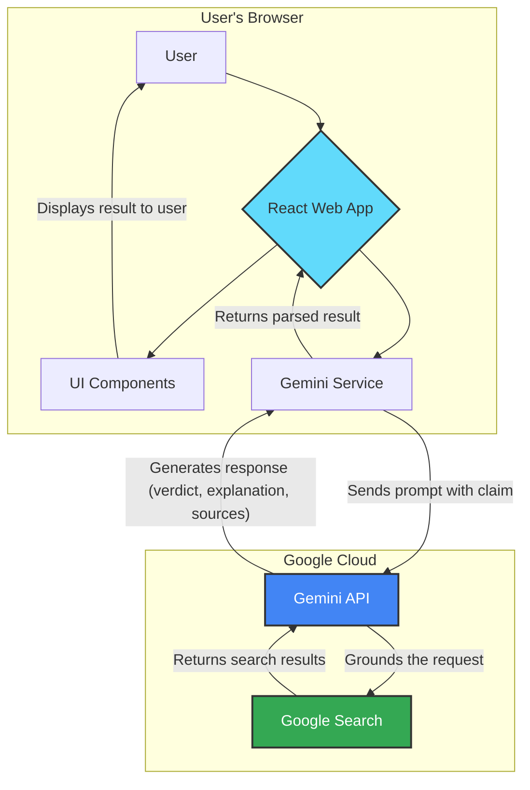
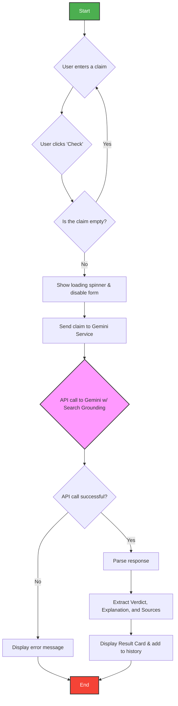
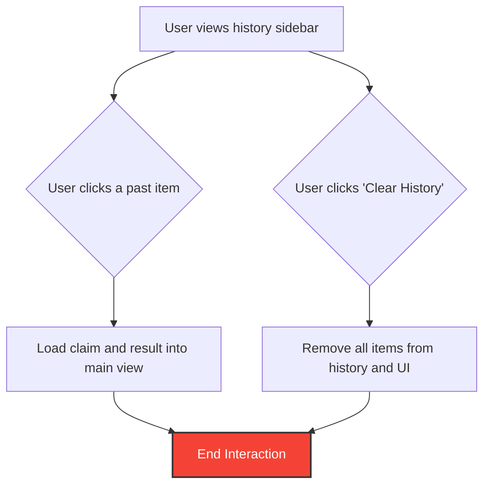
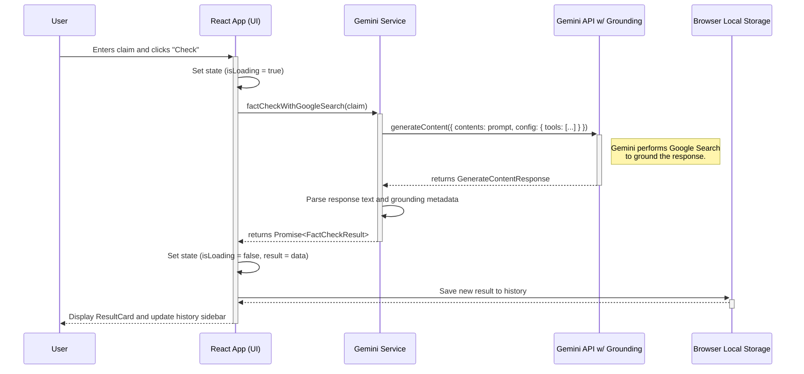

# Building Veritas AI: A Technical Deep-Dive into Real-Time Fact-Checking with Gemini

In an era saturated with information, the ability to quickly distinguish fact from fiction is more critical than ever. This challenge inspired me to build **Veritas AI**, a real-time fact-checking web application. 

In this post, I'll take you on a technical deep-dive into how I built it. We will cover the high-level architecture, the specific user flow, the API sequence, and the prompt engineering required to make it work.

## The Goal

The goal was to create an application that delivers not just an answer, but a trustworthy, verifiable result. This meant providing three key components for every query:
1.  A clear, unambiguous **verdict**: Is the claim true, false, or more nuanced?
2.  A detailed **explanation** of the reasoning behind the verdict.
3.  A list of verifiable **sources** to build trust and encourage further research.

---

## 1. System Design

To ensure the application was robust and scalable, I approached the development with a formal design process.

### High-Level Architecture (HLD)
Veritas AI follows a clean **Client-Server** model, but with a twist: it utilizes a "Serverless" approach where the client communicates directly with the AI provider. You can view the full [High-Level Design document here](./HLD.md).

By leveraging the `@google/genai` SDK directly in the browser, we eliminate the need for a complex middle-tier for this specific use case, reducing latency and infrastructure complexity.

Here is the high-level component hierarchy:



### Low-Level Design (LLD)
The application is structured as a tree of React components (`App` -> `ResultCard`, `History`), utilizing TypeScript interfaces for strict type safety on the API responses. The prompt parsing logic—converting raw text into a `FactCheckResult` object—is the core logic component. Detailed component structures and interface definitions can be found in the [Low-Level Design document](./LLD.md).

---

## 2. The User Flow

To ensure a smooth user experience, I mapped out the application flow. I separated the main logic from the history interaction to keep things clear.

### Main Fact-Check Flow

This diagram visualizes the decision logic from the moment the user enters a claim to when they receive a result.



### History Interaction Flow

This separate flow handles how users interact with their saved results in the sidebar.



**UX Considerations:**
1.  **Input Validation**: We prevent empty calls (See node `D`) to save API quota.
2.  **Loading States**: Fact-checking with grounding takes slightly longer than standard text generation (2-4 seconds). A clear loading spinner (`E`) is essential.
3.  **History**: We immediately persist the result to `localStorage` and update the sidebar (`L`) so users don't lose their research.

---

## 3. The API Sequence

The most complex part of the application is the handshake between the React App, the Service Layer, and the Gemini API. 

The `geminiService.ts` file acts as the bridge. It handles prompt construction, error catching, and response parsing.

### New Fact-Check Request

This details exactly what happens when the user clicks "Check":



---

## 4. The Code Implementation

### The Prompt Strategy
The most critical part of interacting with an LLM is the prompt. To ensure a consistent and parsable response, I engineered a prompt that explicitly instructs the model on the desired output format.

```typescript
// from services/geminiService.ts
const prompt = `Analyze the following statement for its factual accuracy. 
Begin your response with one of the following verdicts on a single line: 
"VERDICT: TRUE", "VERDICT: FALSE", or "VERDICT: MIXED". 
After the verdict, provide a concise but detailed explanation...`;
```

By forcing the model to output `VERDICT: X` first, we can easily parse the result in JavaScript using basic string manipulation, rather than hoping for a valid JSON object which can sometimes be flaky with smaller models.

### Enabling Search Grounding
To build a *real-time* fact-checker, the model needs access to the live web. Activating Gemini's Google Search grounding feature is surprisingly simple in the config:

```typescript
// from services/geminiService.ts
const response = await ai.models.generateContent({
  model: "gemini-2.5-flash",
  contents: prompt,
  config: {
    // This single line connects the model to live Google Search results
    tools: [{googleSearch: {}}],
  },
});
```

### Parsing Sources
The API returns a specific `groundingMetadata` object. We map this to our UI type:

```typescript
const sources = (response.candidates?.[0]?.groundingMetadata?.groundingChunks as GroundingChunk[]) || [];
```

## Conclusion

Building Veritas AI was a powerful demonstration of how modern AI tools like the Gemini API can be combined with a robust frontend framework like React. 

By mapping out the **Architecture (Top-Down)** to understand the system components, and the **User Flow (Top-Down)** to understand the experience, we were able to write clean, efficient code that solves a real-world problem.

#AI #GoogleGemini #FactChecking #WebDevelopment #React #TypeScript
