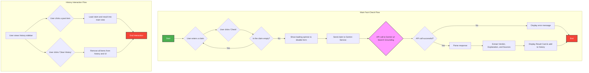

# Veritas AI: User Flow Diagram

This diagram shows the typical flows of events from the user's perspective when using Veritas AI.

```mermaid
graph TD
    subgraph "Main Fact-Check Flow"
        A[Start] --> B{User enters a claim};
        B --> C{User clicks 'Check'};
        C --> D{Is the claim empty?};
        D -- Yes --> B;
        D -- No --> E[Show loading spinner & disable form];
        E --> F[Send claim to Gemini Service];
        F --> G{API call to Gemini w/ Search Grounding};
        G --> H{API call successful?};
        H -- No --> I[Display error message];
        H -- Yes --> J[Parse response];
        J --> K[Extract Verdict, Explanation, and Sources];
        K --> L[Display Result Card & add to history];
        I --> M[End];
        L --> M;
    end

    subgraph "History Interaction Flow"
        N[User views history sidebar] --> O{User clicks a past item};
        O --> P[Load claim and result into main view];
        P --> Q[End Interaction];
        N --> R{User clicks 'Clear History'};
        R --> S[Remove all items from history and UI];
        S --> Q;
    end

    style G fill:#f9f,stroke:#333,stroke-width:2px;
    style A fill:#4CAF50,stroke:#333,stroke-width:2px,color:white;
    style M fill:#F44336,stroke:#333,stroke-width:2px,color:white;
    style Q fill:#F44336,stroke:#333,stroke-width:2px,color:white;
```