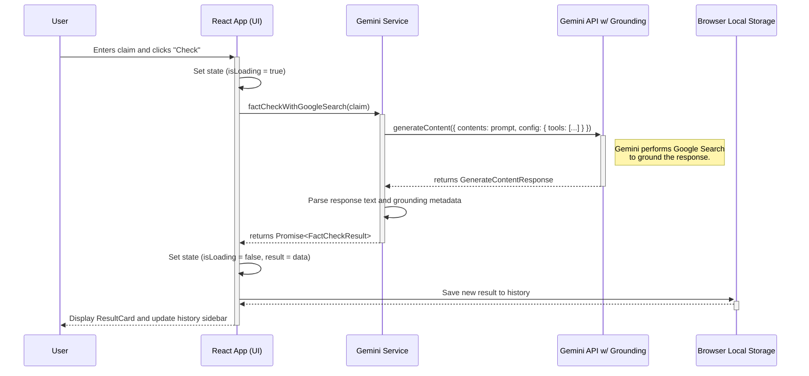
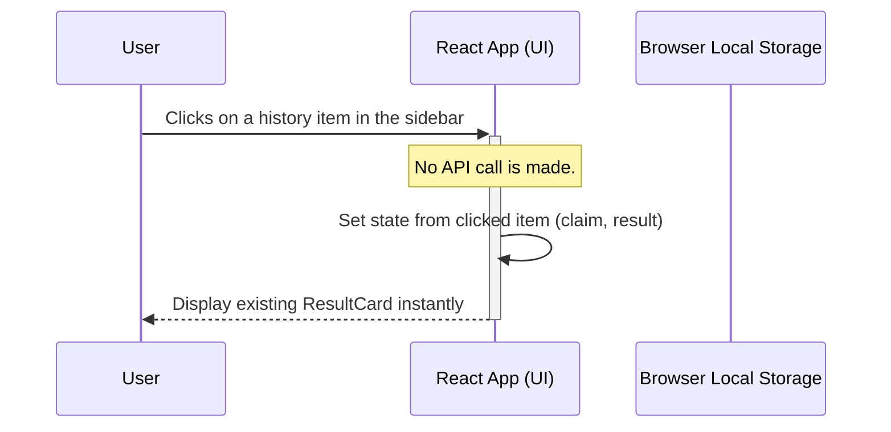

# Veritas AI: Sequence Diagrams

These diagrams detail the sequence of interactions within the application for different user actions.

### New Fact-Check Request

This diagram shows the process when a user submits a new claim to be fact-checked.

### Loading from History

This diagram shows the simple, client-side process when a user clicks on a previously checked item in the history sidebar.

